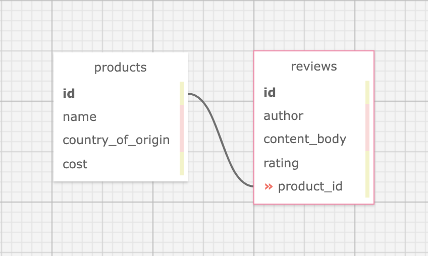

# _Mario's Specialty Foods_

#### _Ruby week 4 Code Review project for Rails with Active Record lesson at Epicodus Bootcamp_

#### Created By: **Christopher Neal**

## Technologies Used

* _Ruby_
* _Gems_
* _Bundler_
* _RSpec_
* _shoulda-matchers_
* _IRB_
* _Pry_
* _Capybara_
* _Postgres_
* _SQL_
* _SQL Designer_
* _Rails_
* _ActiveRecord_
* _Bootstrap SCSS_
* _Faker_
* _Devise_
* _Kaminari_

## Description

_This project was created for Epicodus bootcamp to show proficiency in Rails with Active Record. The application is for a specialty foods company to organize products and reviews._ 
_All users can create an account, log in, browse products, and add reviews._
_Additionally, admins have full CRUD functionality for products and reviews._

## Database Schema

## System Requirements

* Ruby v2.6.5 recommended
* Postgres 12.9  
_(Note: Ruby gem dependencies will be installed automatically by Bundler.)_

## Setup/Installation Requirements

* Clone the GitHub repository: [https://github.com/christophermneal/marios_specialty_foods](https://github.com/christophermneal/marios_specialty_foods)
* From the main project directory, enter `bundle install` in the terminal to populate gems.
* To create a database, type in your terminal: 
      `rake db:setup`
* Enter `rspec` into the terminal to confirm passing of all tests.
* Run `rails s` to start the Rails server.
* Open browswer and enter the url http://localhost:3000/ unless otherwise prompted in the terminal.
* From the home page, click 'Sign in' from the navbar.
* To login as an admin user, fill in the Email form with 'admin@fake.com'
* To login as a non-admin user, fill in the Email form with 'user@fake.com'
* The password for either is 'f4k3p455w0rd'

## Known Bugs

* _None at this time._

## License

_[MIT](https://opensource.org/licenses/MIT)_
Copyright (c) _2022_ _Christopher Neal_

## Support and Contact Details
* _[christopher.m.neal@gmail.com](mailto:christopher.m.neal@gmail.com)_

***************
Project Prompt:
***************
# Mario's Speciality Foods Project Reqs
### General reqs
* Comprehensive validations and callbacks to ensure information is properly saved and formatted in the database.

### Database
* A one-to-many relationship between Products and Reviews will be used.
* All products must have a name, cost and country_of_origin.
* All reviews should have an author, content_body and rating.

### Landing Page
* The landing page should include basic information about the company and should allow users to easily navigate to other areas of the site. This page should also include the three most recently added products and the product with the most reviews. See more information in the Scopes section below.

### Products
* The site needs to include a products section with a list of the tasty products that Mario sells. Each product should be clickable with a detail view.
* Users should be able to add, update and delete new products.
* Users should be able to click an individual product to see its detail page.
* Users should be able to add a review to a product.

### Scopes
* Your site should use scopes to display the following information on the site:  
      + The product with the most reviews.  
      + The three most recently added products.  
      + All products made in the USA for buyers that want to buy local products.  

### Validations
* All fields should be filled out, including rating.
* Rating can only be an integer between 1 and 5.
* The review's content_body must be between 50 and 250 characters.

### Callbacks
* All products are automatically titleized (first letter of each word capitalized) before they are saved to the database.

### Seeding
* Your project should include seed data for 50 products and 250 reviews. Use Faker with a loop to seed the database.

### Flash Messages
* The project should include flash success and error messages for creating products and reviews.

### Authentication
* Add authentication using either BCrypt or Devise.
      + An admin can log in and log out of the application.
      + An admin can add, update and delete products.
      + An admin can add reviews.
      + An admin can ensure that other users don't have access to CRUD functionality.
      + A user can only create an account and add a review to a product.

## Objectives
* Does the project include thorough unit and integration test coverage?
* Do routes follow proper convention, including a root route?
* Does the project have the required validations and callbacks?
* Does the project have the three scopes specified in the prompt? Are the scopes properly utilized in views?
* Is the database properly seeded with the Faker gem?
* Are success and error flash messages used correctly?
* Project is in a polished, portfolio-quality state.
* The prompt’s required functionality and baseline project requirements are in place by the deadline.

## Further Exploration
* Add a scope to retrieve the products with the highest average rating.
* Add a timestamp to posts and make them sortable by oldest or newest.
* Add a 'featured' boolean so admins can choose which products they'd like to feature.
* Allow users to search the site for projects by name.
* Allow users to group products by a country of origin of their choice.
* Allow users to sort posts based on which post has the most comments.
* Show the average rating for each product.
* Change the ratings system so stars (or another icon) are used instead of a number.
* Paginate products so a page of results will only show ten products at a time.
* Use the SimpleCov gem to get your project to 100% test coverage.
* Add user authentication to your site.
* Allow admin users to update or delete their own comments. Other users should not have this functionality.
* Add ActiveStorage to the project so admins can add pictures to their projects and posts.